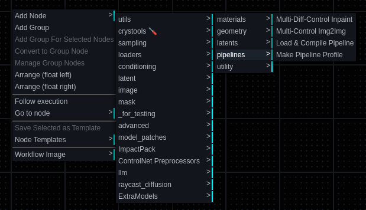

# Raycast Diffusion

> Making Stable Diffusion persistently stable in 3D spaces

This is an effort to make Stable Diffusion's output stable in a 3D space, using a persistent latent-space volume to
store partially diffused latents and using them to guide future diffusion paths using a combination of MultiDiffusion,
Differential Diffusion, and ControlNet.

## Setup

This is distributed as a set of Comfy nodes, with an experimental windowed mode and interactive 3D navigation.

To set up the nodes, clone the repository into your ComfyUI `custom_nodes` directory and make sure the requirements have
been installed:

```shell
> cd ~/ComfyUI/custom_nodes

> git clone https://github.com/ssube/raycast_diffusion.git

> cd raycast_diffusion

> pip3 install -r requirements.txt
```

The nodes should appear in the ComfyUI web UI under the `raycast_diffusion` category:



## Workflow


This workflow is set up for SDXL, with profiles for regular and Lightning/Turbo checkpoints.

Higher resolution versions of the scene are rendered using both Raycast Diffusion and traditional Stable Diffusion to
provide a comparison, then the high resolution raycast version is upscaled and resampled again to produce a 2.3k final
image.

## Methodology

The geometry for the 3D space and projection is extruded from a low-resolution 2D image, where each colors indicates a
material with various parameters such as the image prompt. The prompt embeddings used for the diffusion process are then
assigned to regions of the diffused image using the projected materials, using the tight region masking method from
MultiDiffusion. The entire diffusion process is guided by the depth ControlNet, using the pixel depth from the 3D
projection.

The output of the diffusion model's UNet is captured at the final step or an earlier, intermediate step, and stored
in a 3D volume. The latent voxels are projected into screen space for diffusion, then reprojected back into the 3D
space.

The number of diffusion steps that have been run on each voxel are stored along with the output latents. As additional
images are generated, the existing latents are used to guide additional generation using a combination of inpainting
and differential diffusion for soft inpainting with latent guidance.

### Problems

There are two main problems with storing latent texels in a 3D voxel space:

1. The latent output contains structural data, some of which depends on neighboring pixels. Mis-aligning those texels
   will result in fragmented line segments and other artifacts. These can be partially repaired using additional diffusion
   steps, but that is not a performant solution.
2. The interpolation from voxels in the 3D volume to texels in the screen-space latents causes a degradation in the
   image quality with each projection, that is, it gets blurry over time. This can largely be avoided by not updating
   latent voxels once they have reached the desired step count and only using them for guidance after that.

## Bibliography

- MultiDiffusion: Fusing Diffusion Paths for Controlled Image Generation
  - https://multidiffusion.github.io/
- Differential Diffusion: Giving Each Pixel Its Strength
  - https://differential-diffusion.github.io/
- Explaining the SDXL latent space
  - https://huggingface.co/blog/TimothyAlexisVass/explaining-the-sdxl-latent-space
